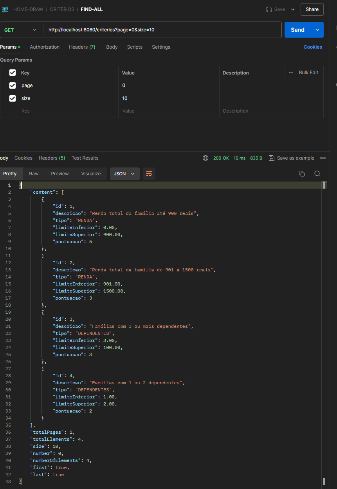
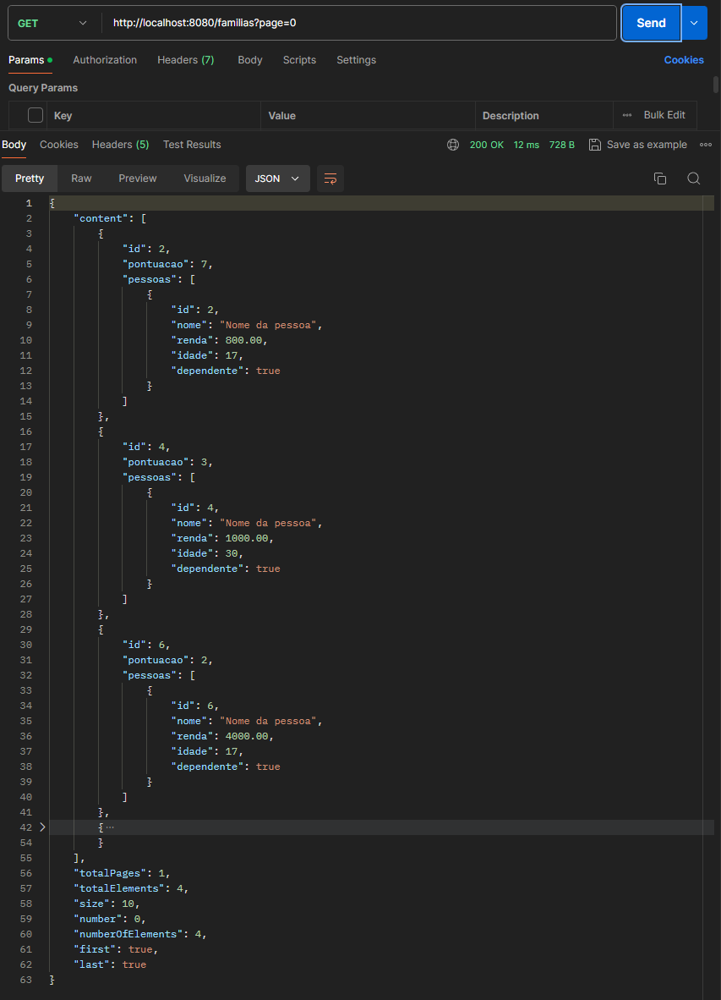

## INICIANDO PROJETO
### CONFIGURANDO POSTGRES
- Iniciando container do postgres
```docker compose up```
- (opcional) - Configure o a conexão com o banco considerando o arquivo
```docker-compose.yml```

### CONFIGURANDO TABELA INICIAL E CRITERIOS
- Execute o script ```create_table.sql``` para criar a tabela de dados
- Os valores das regras podem ser configurados em: ```/criterios```


### IMPORTANTO A COLLECTION NO POSTMAN
- Importe a collection ```HOME-DRAW.postman_collection.json``` no postman. o arquivo esta na pasta postman

### CRIANDO USUÁRIOS
- Execute o endpoint ```/pessoas``` com o método POST para criar um usuário

### CRIANDO FAMILIAS E VINCULANDO PESSOAS
- Execute o endpoint ```/familias``` com o método POST para criar uma família
- Ao vincular os usuários a familia, é possivel verificar a lista de familias por pontuação em ```/familias```


### SITUAÇÕES DE RECALCULO DE PONTOS
- Ao criar editar ou remover uma familia
- Ao criar editar ou remover um usuário
- Ao criar editar ou remover um critério


### PADRÕES DE ARQUITETURA

#### Arquitetura em Camadas (Layered Architecture)
- O projeto segue uma arquitetura em camadas, onde diferentes responsabilidades são separadas em diferentes camadas, como serviços (`services`), repositórios (`repositories`), entidades (`entities`), e mapeadores (`mappers`).

#### Arquitetura Orientada a Serviços (Service-Oriented Architecture)
- A presença de várias classes de serviço (`FamiliaServiceImp`, `PessoaServiceImp`, etc.) indica o uso de uma arquitetura orientada a serviços, onde a lógica de negócios é encapsulada em serviços.

### DESIGN PATTERNS

#### Builder Pattern
- Utilizado na criação de instâncias de `FamiliaEntity` com o método `builder()`.

#### Mapper Pattern
- Utilizado para converter entre entidades e DTOs, como visto nas classes `FamiliaMapper` e `PessoaMapper`.

#### Repository Pattern
- Utilizado para abstrair a lógica de acesso a dados, como visto nas interfaces `FamiliaRepository` e `PessoaRepository`.

#### Exception Handling Pattern
- Utilizado para tratar exceções específicas, como a `NotFoundPessoaException`.

#### Dependency Injection
- Utilizado para injetar dependências nas classes de serviço, facilitado pelo uso de anotações como `@AllArgsConstructor` e `@Service`.

#### Stream API
- Utilizado para manipulação de coleções de forma funcional, como visto nos métodos que utilizam `stream()`, `filter()`, `mapToInt()`, etc.